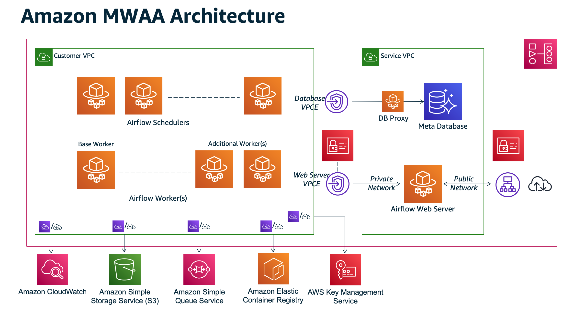

# Infrastructure as Code

This repo contains the Terraform IaC for this project.

## TOC

- [Description](#description)
- [Deployment](#deployment)
- [Testing](#testing)

## Description

The Terraform code will deploy the following Amazon MWAA with VPC

- Creates a new sample VPC, 2 Private Subnets and 2 Public Subnets
- Creates Internet gateway for Public Subnets and NAT Gateway for Private Subnets
- Creates Amazon MWAA Environment with S3 bucket, Security Group and IAM Role

Adapted from: https://github.com/aws-ia/terraform-aws-mwaa/tree/main/examples/basic

### 1) Amazon Managed Workflows for Apache Airflow

Image Source: https://docs.aws.amazon.com/mwaa/latest/migrationguide/mwaa-architecture.html



## Deployment

:pencil: This repo will become a sub module of the main solution, therefore limited deployment instructions are listed below, rather use the main solutions repo found here: https://github.com/CloudStream-Innovations/main-solution

### Terraform Deployment

Please review a tutorial such as for detailed instructions on deploying a Terraform solution like this one: https://medium.com/@rizkiprass/beginner-terraform-tutorial-launching-ec2-in-aws-using-terraform

#### Basic commands

```
terraform plan
terraform apply
```

## Testing

TO DO: Put in place a Github Action for this repo that tests the IaC against Local Stack
TO DO: See if it is possible to update the sub module on the main-solution if the test passes
